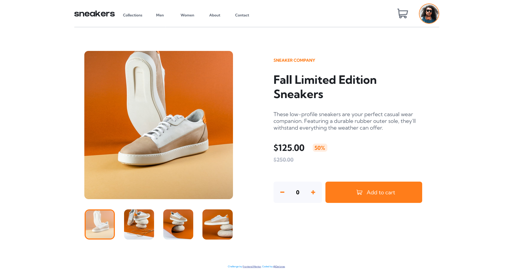

# Frontend Mentor - E-commerce product page solution

This is a solution to the [E-commerce product page challenge on Frontend Mentor](https://www.frontendmentor.io/challenges/ecommerce-product-page-UPsZ9MJp6).

## Table of contents

- [Overview](#overview)
  - [The challenge](#the-challenge)
  - [Screenshot](#screenshot)
  - [Links](#links)
- [My process](#my-process)
  - [Built with](#built-with)
  - [What I learned](#what-i-learned)
  - [Continued development](#continued-development)
  - [Useful resources](#useful-resources)
- [Author](#author)
- [Acknowledgments](#acknowledgments)

## Overview

### The challenge

Users should be able to:

- View the optimal layout for the site depending on their device's screen size
- See hover states for all interactive elements on the page
- Open a lightbox gallery by clicking on the large product image
- Switch the large product image by clicking on the small thumbnail images
- Add items to the cart
- View the cart and remove items from it

### Screenshot

<<<<<<< HEAD

=======
- [x] Create drawing from design (structure of design)(1st task)
- [x] Create of repo (2nd task)
- [x] Create HTML layout (not include modal elements) (3rd task)
- [x] Create CSS layout according style guides (4th task)
- [x] Create grid layout for mobile first (5th task)
- [x] Craete grid layout for desktop (6th task)
- [x] Implement JavaScript (7th task)
- [x] Overview of solution and RWD (8th task)
- [x] Tada it is done. Congratulation you reach your goal.🎉
>>>>>>> 314c9b21d8ac5df301b28855dbae3e794edad737

<<<<<<< HEAD

### Links

- Solution URL: (https://github.com/Darionas/ecommerce-product-page)
- Live Site URL: (https://darionas.github.io/ecommerce-product-page/)

## My process

* Set HTML layout:
* Create CSS external file to set style for HTML layout:
  * To achieve responsive web design, implement grid layout module:
     * Create first for mobile;
     * Later for desktop;
* Implement javaScript;

### Built with

- Semantic HTML5 markup
- CSS custom properties:
    - Flexbox
    - CSS Grid
    - Mobile-first workflow
- JavaScript

But created with love.

### What I learned

- Change color for svg image fill property with pure css;
- Change color for svg image stroke property with pure css;
- On hover style another element;

### Continued development

- Grid layout module.
- JavaScript.
- Practise dealing with Git & GitHub.
- Practise creating navigation for mobile layout. 

### Useful resources

- [Change color for svg image fill property with pure css](https://stackoverflow.com/questions/22252472/how-can-i-change-the-color-of-an-svg-element#answer-53336754) - This helped me to style element on hover effect with pure css.
- [Change color for svg image stroke property with pure css](https://stackoverflow.com/questions/22289214/how-to-change-stroke-color-in-svg-image-on-hover-event#answer-22290452) - This helped me to style element on hover effect with pure css.
- [On hover style another element](https://stackoverflow.com/questions/4502633/how-to-affect-other-elements-when-one-element-is-hovered#answer-4502693) - This helped me on hover effect style another element with pure css.

## Author

- Frontend Mentor - [@Darionas](https://www.frontendmentor.io/profile/Darionas)

## Acknowledgments

- Thank you Frontend Mentor team for opportunity to try, practice, train yourself in different level challenges and gain invaluable experience.
- Thank you @Vikram from Frontend Mentor for guidance.
- Thank you @Grace from Frontend Mentor for guidance.
=======
- [Frontend_Mentor](https://www.frontendmentor.io/license)
>>>>>>> 314c9b21d8ac5df301b28855dbae3e794edad737
